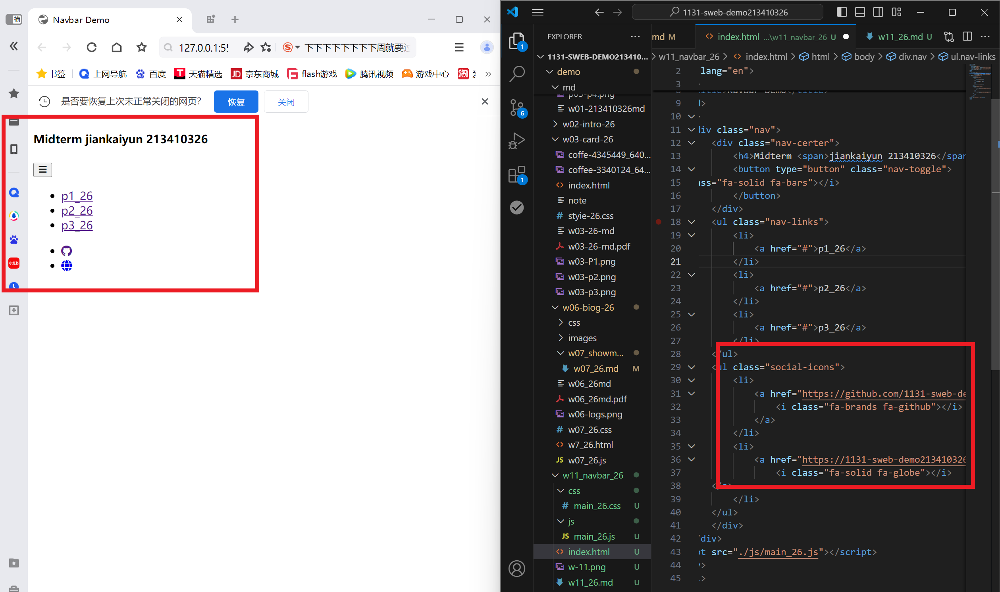
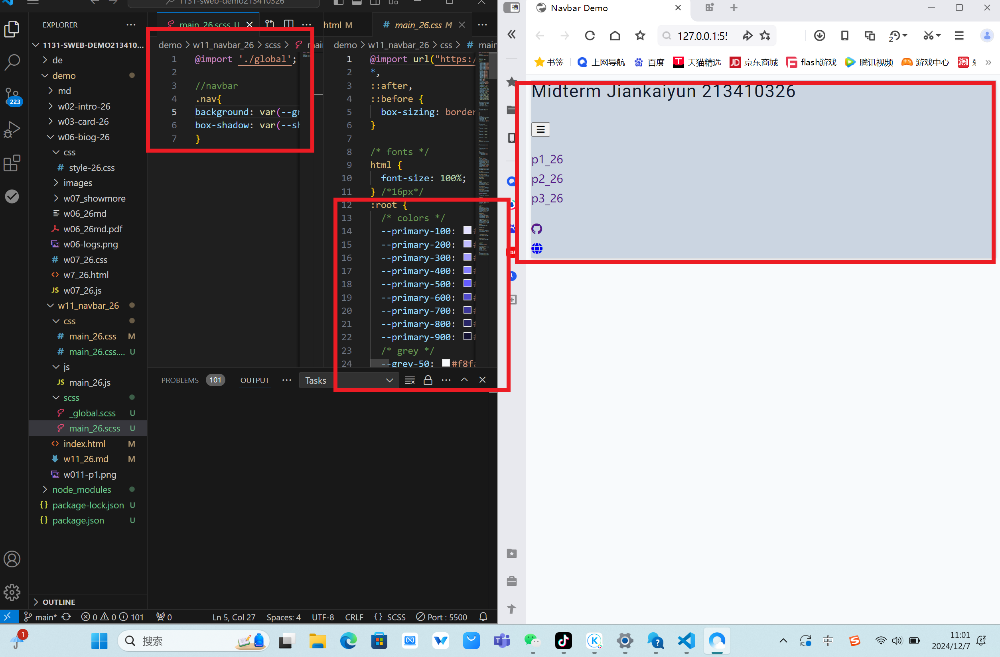
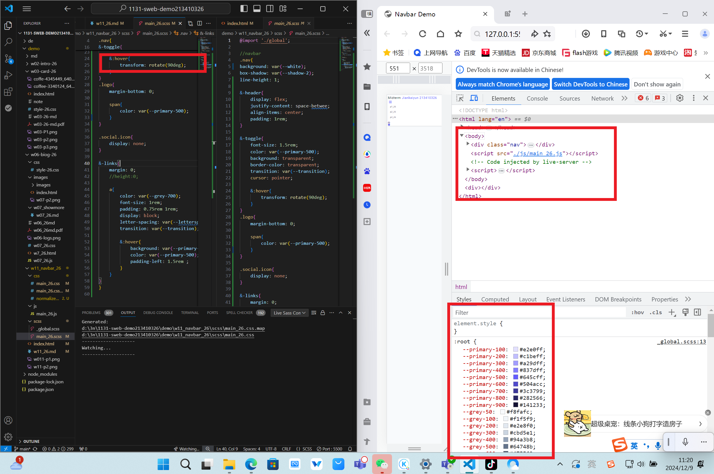

[My Github URL](https://github.com/1131-sweb-demo-213410326-crypto/1131-sweb-demo213410326.git)
[My Vercel URL](https://1131-sweb-demo213410326.vercel.app/)

### w11-p1: Create html code for navbar


```
08a737f 1131-sweb-demo21341032  Mon Oct 28 19:08:10 2024 +0800 
```

### w11-p2: Use sass to convert scss/main_xx.scss to css/main_xx.css



```
bdeb17a 1131-sweb-demo21341032  Sat Dec 7 14:02:08 2024 +0800        w11-p2: Use sass to convert scss/main_xx.scss to css/main_xx.css
```

### w11-p3: scss for small screen


```
46d25b6 1131-sweb-demo21341032  Mon Dec 9 11:28:33 2024 +0800   w11-p3: scss for small screen
```
